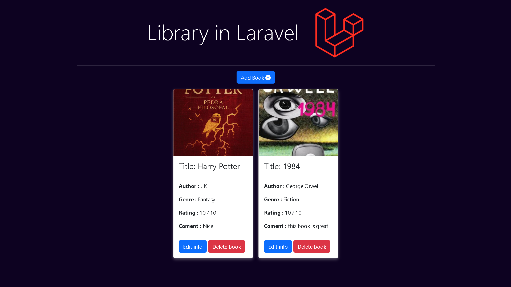

# Library in Laravel


## About



This project was created to put my Laravel skills into practice by building a CRUD application where users can add, edit, and remove books, including details like title, author, rating, cover, and more.


## Stack

- <a href="https://laravel.com"> Laravel</a>
- <a href="https://getbootstrap.com"> Bootstrap</a>
- <a href="https://developer.mozilla.org/en-US/docs/Web/JavaScript"> JavaScript</a>
- <a href="https://developer.mozilla.org/en-US/docs/Web/HTML"> HTML</a>
- <a href="https://developer.mozilla.org/en-US/docs/Web/CSS"> CSS</a>


## Getting Started

Set up your project on loaclhost by following steps below

### Requirements

- **PHP** >= 8.1
- **Composer**
- **Node.js** e **npm**
- **MySQL**
- **Git**

### Installation 

1- install dependencies of php with composer
 ```sh
    composer install
   ```
2- install packages NPM
 ```sh
    npm install
   ```
3- Set up the `.env` file
  - Copy the `.env.example` file to `.env`
  - Set up your database credentials in the `.env` file

4- Execute migrations to set up database 
 ```sh
    php artisan migrate
   ```
5- Run server of development Vite
  ```sh
    npm run dev
   ```
6- Run server laravel
  ```sh
    php artisan serve
   ```


# Features
- Add books with title,author,category,rating,comments and cover
- Edit info of books
- Remove books
- List all books added


# Contact
[![LinkedIn][linkedin-shield]][linkedin-url]
[](https://alexavier.dev.br)

# License
[![MIT License][license-shield]][license-url]


[license-shield]: https://img.shields.io/github/license/othneildrew/Best-README-Template.svg?style=for-the-badge
[license-url]: https://github.com/othneildrew/Best-README-Template/blob/master/LICENSE.txt
[linkedin-shield]: https://img.shields.io/badge/-LinkedIn-black.svg?style=for-the-badge&logo=linkedin&colorB=555
[linkedin-url]: https://www.linkedin.com/in/alexsandroxavier/
[product-screenshot]: images/screenshot.png
[Laravel.com]: https://img.shields.io/badge/Laravel-FF2D20?style=for-the-badge&logo=laravel&logoColor=white
[Laravel-url]: https://laravel.com
[Bootstrap.com]: https://img.shields.io/badge/Bootstrap-563D7C?style=for-the-badge&logo=bootstrap&logoColor=white
[Bootstrap-url]: https://getbootstrap.com
